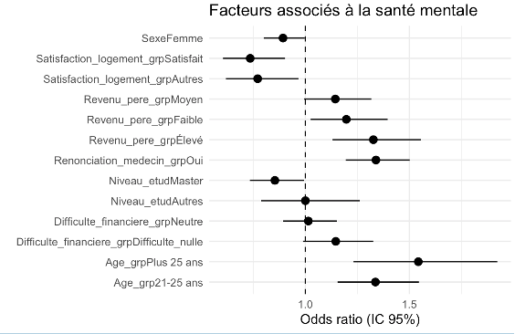
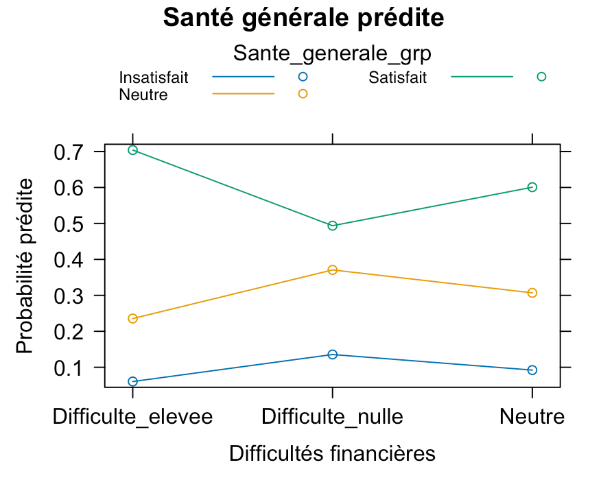
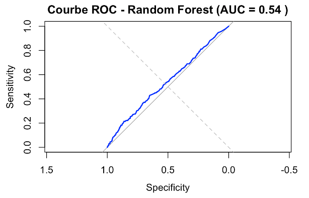
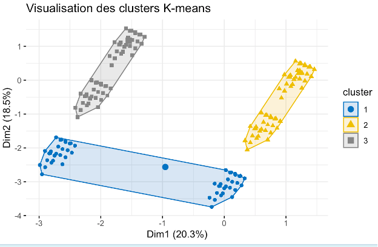

# 📊 Analyse des données de l’Observatoire de la Vie Étudiante (OVE)

## 🎯 Objectif
Analyser les déterminants de la santé mentale et générale des étudiants en France à partir des données OVE 2016.  
L’étude combine **méthodes économétriques classiques** et **approches Machine Learning**.

## 📂 Structure du projet
- **data/** : données nettoyées ou scripts de préparation  
- **scripts/** : code R pour analyses et modèles  
- **results/** : figures et tableaux exportés  
- **report/** : rapport complet (PDF)

---

## 🔎 Méthodologie
1. **Analyse descriptive** : profils étudiants, santé mentale et conditions de vie.  
2. **Analyse bivariée** : associations entre variables sociodémographiques et santé mentale.  
3. **Modèles économétriques** :
   - Logit binaire (santé mentale)
   - Logit ordinal et multinomial (santé générale)
4. **Modèles Machine Learning** :
   - Random Forest (importance des variables, AUC/ROC)
   - Clustering K-means (profils-types d’étudiants)

---

## 📊 Résultats

### 1. Résultats économétriques

- **Santé mentale (logit binaire)**  

- **Santé générale (logit ordinal)**  

---

### 2. Résultats Machine Learning

#### 🔹 Random Forest
- Courbe ROC  

- Matrice de confusion  
[Télécharger en CSV](results/confusion_matrix_rf.csv)

- Indicateurs de performance  
[Télécharger en CSV](results/performance_random_forest.csv)

#### 🔹 Clustering K-means
- Visualisation des clusters  

---

## 📝 Conclusion
- Les **difficultés financières**, le **revenu parental** et la **satisfaction du logement** sont les principaux déterminants de la santé mentale.  
- Le **modèle Random Forest** confirme ces variables comme prédictives majeures.  
- Le **clustering K-means** révèle des profils distincts d’étudiants, avec des vulnérabilités différenciées en santé mentale.  

---
